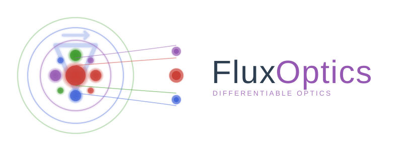

<p align="center">
  
</p>

# FluxOptics.jl

[](https://anscoil.github.io/FluxOptics.jl/stable/)
[](https://anscoil.github.io/FluxOptics.jl/dev/)
[](https://github.com/anscoil/FluxOptics.jl/actions/workflows/CI.yml?query=branch%3Amain)

**Differentiable optical propagation and inverse design in Julia**

FluxOptics.jl enables gradient-based optimization of optical systems through fully differentiable wave propagation. It allows you to design diffractive optical elements, optimize beam shaping, reconstruct optical fields, and characterize photonic structures.

## ✨ Key Features

- 🌊 **Wave propagation**: Angular Spectrum, Rayleigh-Sommerfeld, Beam Propagation Method
- 🎯 **Inverse design**: End-to-end optimization of phase masks, DOEs, and refractive index profiles
- 🔧 **Proximal optimization**: FISTA, TV regularization, ISTA sparsity, custom constraints
- 📊 **Multi-wavelength & multimode**: Polychromatic propagation and mode coupling
- 🚀 **GPU accelerated**: Seamless CUDA support
- 🧩 **Composable architecture**: Intuitive piping syntax for complex optical systems

## Applications

FluxOptics.jl is designed for:
- **Inverse design**: Diffractive optical elements, metasurfaces, beam shaping
- **Optical characterization**: Phase retrieval, tomographic reconstruction, waveguide/fiber analysis
- **Laser physics**: Cavity eigenmode analysis, mode selection, resonator design
- **Photonics**: Fiber coupling, multimode decomposition, GRIN media simulation

## 📦 Installation
```julia
using Pkg
Pkg.add("FluxOptics")
```

**Minimum Julia version**: 1.11

### Required for optimization workflows

To run gradient-based optimization, you need to install:
```julia
Pkg.add(["Optimisers", "Zygote"])
```

### Optional: Visualization

For plotting capabilities:
```julia
Pkg.add("CairoMakie")  # for visualize()
Pkg.add("GLMakie")     # for visualize_slider()
```

## 🚀 Quick Start

Design diffractive optical elements that split a Gaussian beam into two equal outputs:

```julia
using FluxOptics, Zygote

# Uncomment to use more FFTW threads
# using FFTW
# FFTW.set_num_threads(6)

# using CUDA  # Uncomment to use CUDA

# Setup: 512×512 grid, 1 μm pitch, 1.064 μm wavelength
ns = (512, 512)
ds = (1.0, 1.0)
λ = 1.064
x, y = spatial_vectors(ns, ds)

# Source and target fields
u0 = ScalarField(Gaussian(30.0)(x, y), ds, λ)
target = ScalarField(Gaussian(30.0)(x, y, Shift2D(-60, 0)), ds, λ) +
         ScalarField(Gaussian(30.0)(x, y, Shift2D(60, 0)), ds, λ)
# Uncomment if you are using CUDA
# u0 = cu(u0)
# target = cu(target)
normalize_power!(u0)
normalize_power!(target)

# Optical system: source → propagation → DOE → propagation → DOE → propagation
doe1 = Phase(u0, zeros(size(u0)); trainable=true, buffered=true)
doe2 = Phase(u0, zeros(size(u0)); trainable=true, buffered=true)
prop1 = RSProp(u0, 1500.0)
prop2 = RSProp(u0, 2000.0)
system = ScalarSource(u0) |> prop1 |> doe1 |> prop2 |> doe2 |> prop1

# Optimize
loss(system) = sum(abs2, abs2.(system().out.electric - target.electric))
opt = FluxOptics.setup(Fista(4e3), system)

# Lower the number of iterations for a quick test on cpu
for i in 1:1000
    l, ∇ = Zygote.withgradient(loss, system)
    FluxOptics.update!(opt, system, ∇[1])
end

# Result: 99.25% coupling efficiency
output = system().out
coupling_efficiency(output, target)
```

## 📖 Tutorials

**[Complete documentation →](https://anscoil.github.io/FluxOptics.jl/stable/)**

Five comprehensive tutorials:

| Tutorial | Description |
|----------|-------------|
| [**Fox-Li Cavity**](https://anscoil.github.io/FluxOptics.jl/stable/tutorials/01_FoxLi_simulation/) | Eigenmode analysis in semi-degenerate laser resonators |
| [**Field Retrieval**](https://anscoil.github.io/FluxOptics.jl/stable/tutorials/02_field_retrieval/) | Reconstruct amplitude and phase from intensity-only data |
| [**Multi-Wavelength**](https://anscoil.github.io/FluxOptics.jl/stable/tutorials/03_RGB_beam_shaping/) | Independent RGB beam control with cascaded DOEs |
| [**Waveguide Tomography**](https://anscoil.github.io/FluxOptics.jl/stable/tutorials/04_waveguide_tomography/) | Refractive index reconstruction from angle-resolved intensity |
| [**Multimode Shaping**](https://anscoil.github.io/FluxOptics.jl/stable/tutorials/05_multimode_intensity_shaping/) | Shape 105 modes into square/ring targets with TV regularization |

## 🤝 Contributing

Contributions are welcome! Please see [CONTRIBUTING.md](CONTRIBUTING.md) for guidelines on:
- Reporting bugs and requesting features
- Sharing use cases and examples
- Submitting code contributions

## 📝 Citation

If you use FluxOptics.jl in your research, please cite:

```bibtex
@software{fluxoptics2025,
  author = {Barré, Nicolas},
  title = {FluxOptics.jl: Differentiable Optical Simulations in Julia},
  year = {2025},
  url = {https://github.com/anscoil/FluxOptics.jl}
}
```

## 📄 License

MIT License - see [LICENSE](LICENSE) file for details.

## 🙏 Acknowledgments

Built on the Julia ecosystem:
- [Zygote.jl](https://github.com/FluxML/Zygote.jl) / [ChainRulesCore.jl](https://github.com/JuliaDiff/ChainRulesCore.jl) for automatic differentiation
- [Optimisers.jl](https://github.com/FluxML/Optimisers.jl) for optimization algorithms
- [CUDA.jl](https://github.com/JuliaGPU/CUDA.jl) for GPU acceleration
