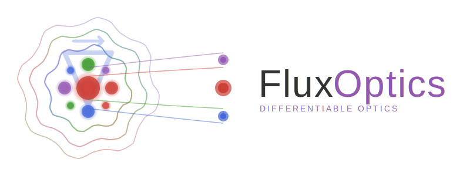

<p align="center">
  
</p>

# FluxOptics.jl

[](https://anscoil.github.io/FluxOptics.jl/stable/)
[](https://anscoil.github.io/FluxOptics.jl/dev/)
[](https://github.com/anscoil/FluxOptics.jl/actions/workflows/CI.yml?query=branch%3Amain)

**Differentiable optical propagation and inverse design in Julia**

FluxOptics.jl enables gradient-based optimization of optical systems through fully differentiable wave propagation. Design diffractive optical elements, optimize beam shaping, reconstruct optical fields, and characterize photonic structures—all with automatic differentiation.

## ✨ Key Features

- 🌊 **Full wave propagation**: Angular Spectrum, Rayleigh-Sommerfeld, Beam Propagation Method
- 🎯 **Inverse design**: Optimize phase masks, DOEs, and refractive index profiles end-to-end
- 🔧 **Proximal optimization**: FISTA, TV regularization, ISTA sparsity, custom constraints
- 📊 **Multi-wavelength**: Simultaneous chromatic optimization and polychromatic beam shaping
- 🚀 **GPU accelerated**: Seamless CUDA support for large-scale problems
- 🧩 **Composable**: Intuitive piping syntax for complex optical systems

## 📦 Installation

```julia
using Pkg
Pkg.add("FluxOptics")
```

## 🚀 Quick Start: Optimize a Beam Splitter

Design diffractive optical elements that split a Gaussian beam into two equal output beams:

```julia
using FluxOptics, Zygote
using CUDA  # Comment if you don't have CUDA

# Define target: two separated Gaussians
ns = (512, 512)
ds = (1.0, 1.0)
λ = 1.064
x, y = spatial_vectors(ns, ds)
u0 = ScalarField(Gaussian(30.0)(x, y), ds, λ)
target_mode = ScalarField(Gaussian(30.0)(x, y, Shift2D(-60, 0)), ds, λ) +
              ScalarField(Gaussian(30.0)(x, y, Shift2D(60, 0)), ds, λ)
normalize_power!(u0)
normalize_power!(target_mode)

# Comment if you don't have CUDA
u0 = cu(u0)
target_mode = cu(target_mode)

# Optical system: source → trainable DOEs → propagation
doe1 = Phase(u0, zeros(size(u0)); trainable=true, buffered=true)
doe2 = Phase(u0, zeros(size(u0)); trainable=true, buffered=true)
prop1 = RSProp(u0, 1500.0)
prop2 = RSProp(u0, 2000.0)
system = ScalarSource(u0) |> prop1 |> doe1 |> prop2 |> doe2 |> prop1

# Optimize DOE phases to match target mode
loss(sys) = sum(abs2, abs2.(sys().out.electric - target_mode.electric))
opt = FluxOptics.setup(Fista(4e3), system)

for i in 1:1000
    l, ∇ = Zygote.withgradient(loss, system)
    FluxOptics.update!(opt, system, ∇[1])
end

output_mode = system().out
# After 1000 iterations: coupling efficiency reaches 99.25%
coupling_efficiency(output_mode, target_mode)
```

See the [documentation](https://anscoil.github.io/FluxOptics.jl/stable/) for complete examples.

## 📚 Tutorials

Learn through hands-on examples:

| Tutorial | Description |
|----------|-------------|
| [**Fox-Li Cavity Simulation**](https://anscoil.github.io/FluxOptics.jl/stable/tutorials/01_FoxLi_simulation/) | Find laser cavity eigenmodes near degeneracy points. Demonstrates gain media, iterative propagation, and quasi-Ince-Gaussian mode formation. |
| [**Phase Retrieval**](https://anscoil.github.io/FluxOptics.jl/stable/tutorials/02_field_retrieval/) | Reconstruct complex fields from intensity-only measurements. Shows multi-plane optimization and handling non-convex inverse problems. |
| [**RGB Beam Shaping**](https://anscoil.github.io/FluxOptics.jl/stable/tutorials/03_RGB_beam_shaping/) | Design cascaded DOEs for independent control of red, green, and blue wavelengths. Demonstrates chromatic optimization. |
| [**Waveguide Tomography**](https://anscoil.github.io/FluxOptics.jl/stable/tutorials/04_waveguide_tomography/) | Reconstruct refractive index profiles from angle-resolved data. Full-wave tomography with joint aberration correction. |

## 🎯 What Can You Build?

FluxOptics.jl is designed for researchers and engineers working on:

### Inverse Design
- Diffractive optical elements (DOEs) and metasurfaces
- Computer-generated holograms
- Beam shaping and intensity control
- Achromatic and polychromatic focusing elements

### Optical Characterization
- Phase retrieval from intensity measurements
- Tomographic reconstruction of refractive index profiles
- Aberration estimation and correction
- Waveguide and fiber characterization

### Laser Physics
- Cavity eigenmode analysis
- Mode selection and control
- Gain-guided beam propagation
- Resonator design near degeneracy points

### Photonics Integration
- Fiber coupling optimization
- Multimode beam decomposition
- Graded-index (GRIN) media simulation
- Optical propagation through complex media

## 🛠️ Key Capabilities

### Multi-Wavelength Optimization

Design optical elements that work across multiple wavelengths:

```julia
# Simultaneous RGB beam shaping
λs = [0.640, 0.538, 0.455]  # Red, green, blue
u0 = ScalarField((nx, ny, 3), ds, λs)

# Optimize DOE cascade for chromatic control
system = source |> doe1 |> prop |> doe2 |> prop |> doe3
```

### Proximal Optimization

Use advanced regularization for better convergence:

```julia
# ISTA sparsity regularization
sample_rule = ProxRule(Fista(0.01), IstaProx(3e-5))
aberration_rule = Fista(0.03)

# Different rules for different components
opt = setup(make_rules(sample => sample_rule, 
                       aberrations => aberration_rule), 
            system)
```

### GPU Acceleration

Seamless GPU support for large-scale problems:

```julia
using CUDA

u0 = cu(u0)  # Move to GPU
system = source |> components...  # Works transparently
result = system()  # Computed on GPU
```

### Beam Propagation Method

Simulate propagation through graded-index media:

```julia
# Define refractive index profile Δn(x,z)
Δn = ... # 2D array

# AS-BPM through sample
sample = AS_BPM(u0, L_sample, n_bulk, Δn; trainable=true)
```

## 📖 Documentation

**[Read the full documentation →](https://anscoil.github.io/FluxOptics.jl/stable/)**

- [Installation guide](https://anscoil.github.io/FluxOptics.jl/stable/)
- [Tutorials](https://anscoil.github.io/FluxOptics.jl/stable/)
- [API reference](https://anscoil.github.io/FluxOptics.jl/stable/api/)

## 🤝 Contributing

Contributions are welcome! Please feel free to:
- Report bugs or request features via [GitHub Issues](https://github.com/anscoil/FluxOptics.jl/issues)
- Submit pull requests with improvements
- Share your use cases and examples

## 📝 Citation

If you use FluxOptics.jl in your research, please cite:

```bibtex
@software{fluxoptics2025,
  author = {Barré, Nicolas},
  title = {FluxOptics.jl: Differentiable Optical Simulations in Julia},
  year = {2025},
  url = {https://github.com/anscoil/FluxOptics.jl},
  version = {0.1.0}
}
```

## 📄 License

MIT License - see [LICENSE](LICENSE) file for details.

## 🙏 Acknowledgments

Built on the excellent Julia ecosystem:
- [Zygote.jl](https://github.com/FluxML/Zygote.jl) and [ChainRulesCore.jl](https://github.com/JuliaDiff/ChainRulesCore.jl) for automatic differentiation
- [Optimisers.jl](https://github.com/FluxML/Optimisers.jl) for optimization algorithms
- [CUDA.jl](https://github.com/JuliaGPU/CUDA.jl) for GPU acceleration

---

**Maintainer**: Nicolas Barré ([@anscoil](https://github.com/anscoil))
