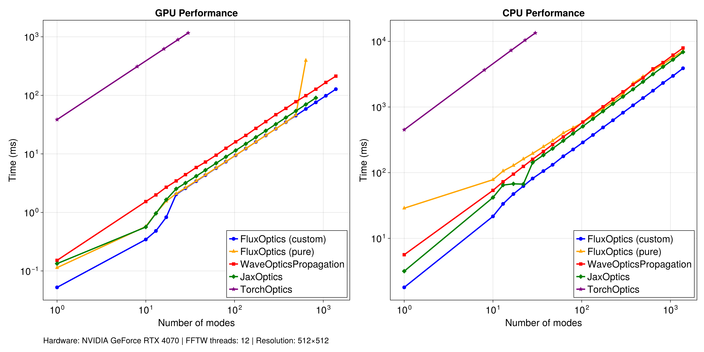
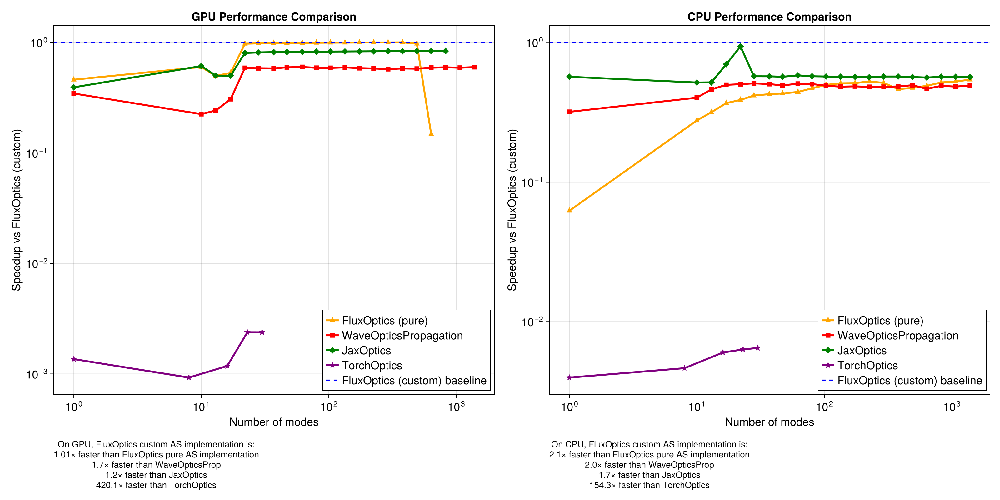

# FluxOptics Benchmarks

This directory contains performance benchmarks comparing FluxOptics against other optical propagation libraries.

## Angular Spectrum Propagation

### Implementations Compared

**Julia:**
- **FluxOptics (custom)**: FluxOptics using `ASProp` relying on optimized FFT/BFFT plans with in-place operations
- **FluxOptics (pure)**: FluxOptics using `ASPropZ` relying on pure FFT/BFFT function calls
- **[WaveOpticsPropagation.jl](https://github.com/JuliaPhysics/WaveOpticsPropagation.jl)**: Alternative Julia library for wave optics

**Python:**
- **[JaxOptics](https://github.com/anscoil/jaxoptics)**: Minimal JAX implementation developed for this comparison, representing best-practice Python/JAX performance
- **[TorchOptics](https://github.com/MatthewFilipovich/torchoptics)**: PyTorch-based optical system design library

### Benchmark Setup

All benchmarks measure bidirectional angular spectrum propagation (forward +z and backward -z) performance across different numbers of optical modes, on both GPU and CPU.

**Configuration:**
- Resolution: 512×512 pixels
- Wavelength: 1.064 μm
- Propagation distance: 2 mm
- Measurements: 20 iterations (5 for TorchOptics due to slow performance)

**Test modes:**
The benchmark uses Laguerre-Gaussian (LG) modes with beam waist w₀ = 25.0 μm. Mode generation creates 21 radial order groups (p=0 to p=10) with azimuthal orders l satisfying |l| + 2p ≤ 20, yielding 231 unique modes (21×22/2). These 231 modes are duplicated 6× to reach the maximum test case of 1386 modes.

**Validation:**
All implementations were validated against analytically propagated Laguerre-Gaussian modes. Numerical propagation results show correlation >0.9999 (error <1e-4) with analytical solutions, confirming correctness of all tested libraries before benchmarking.

**Hardware:**
- GPU: NVIDIA GeForce RTX 4070 Super
- CPU: AMD Ryzen 5 5600X with FFTW (12 threads)

### Results

#### Performance Comparison

Raw execution times show FluxOptics (custom) achieving the best performance on both GPU and CPU across all mode counts tested (up to 1386 modes). The optimized FFT plan implementation maintains consistent performance scaling throughout the entire range.

**Key observations:**

- **FluxOptics (pure)** performs nearly identically to custom on GPU for low to moderate mode counts, but experiences significant performance degradation beyond ~500 modes and runs out of memory around 700 modes

- **WaveOpticsPropagation.jl** shows competitive performance but remains consistently 1.7× slower on GPU and 2.0× slower on CPU compared to FluxOptics (custom)

- **JaxOptics** demonstrates the best Python performance, running 1.2× slower than FluxOptics (custom) on GPU and performing on par with FluxOptics (pure) on CPU. However, it runs out of memory around 850 modes on GPU

- **TorchOptics** exhibits significantly degraded performance and memory efficiency, being **420× slower** on GPU and **154× slower** on CPU. Testing beyond 30 modes was not pursued due to excessive runtime.

#### Speedup Analysis

Relative performance versus FluxOptics (custom) baseline on logarithmic scale. The baseline (1.0×) represents FluxOptics (custom) performance, with values below 1.0 indicating slower execution.

**Performance summary:**
- FluxOptics (pure): 0.8-1.0× on GPU (identical beween 50 and 500 modes, degrades at high modes)
- WaveOpticsPropagation: ~0.6× on GPU, ~0.5× on CPU
- JaxOptics: ~0.8× on GPU, ~0.6× on CPU
- TorchOptics: ~0.002× on GPU, ~0.006× on CPU

### Reproducibility

Benchmark scripts and plotting code are available in the `angular_spectrum/scripts` subdirectory. Each implementation's benchmark script can be run independently to regenerate results.
