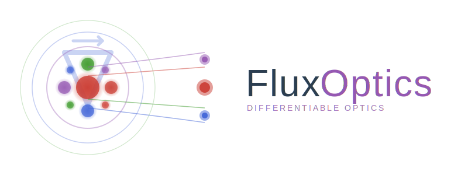

```@raw html
<p align="center">
  
</p>
```

# FluxOptics.jl

*Differentiable optical propagation and inverse design in Julia*

FluxOptics.jl is a Julia package for simulating scalar optical field propagation with full support for automatic differentiation. Design and optimize optical systems through gradient-based methods.

## Features

- 🌊 **Scalar field propagation**: Angular Spectrum, Rayleigh-Sommerfeld, Collins integral, Beam Propagation Method
- 🎭 **Optical components**: Phase masks, amplitude masks, DOEs, graded-index media
- 🎯 **Optimization ready**: Fully differentiable with Zygote/Enzyme support via ChainRulesCore
- 🔧 **Proximal operators**: TV regularization, sparsity, constraints
- 📊 **Built-in metrics**: Power coupling, field matching, intensity shaping
- 🚀 **GPU support**: CUDA acceleration available

## Quick Example

```@example vortex
using FluxOptics, CairoMakie

# 1. Create Gaussian source
gaussian = Gaussian(20.0)
xv, yv = spatial_vectors(256, 256, 1.0, 1.0)
u = ScalarField(gaussian(xv, yv), (1.0, 1.0), 1.064)
source = ScalarSource(u)

# 2. Optical system with vortex phase mask
probe = FieldProbe()
vortex_phase = Phase(u, (x, y) -> atan(y, x))  # topological charge l=1
propagator = ASProp(u, 1000.0)  # 1mm far-field propagation

system = source |> vortex_phase |> probe |> propagator

# 3. Execute system
result = system()
output_mode = result.out
probe_mode = result.probes[probe]

# 4. Visualize evolution
visualize((probe_mode, output_mode), (intensity, phase);
	colormap=(:inferno, :viridis), show_colorbars=true, height=120)
```

## Documentation Structure

### Tutorials *(coming soon)*
Step-by-step guides for common use cases

### [API Reference](api/index.md)
Complete documentation of all modules, types, and functions:
- **[GridUtils](api/gridutils/index.md)**: Coordinate systems and transformations
- **[Modes](api/modes/index.md)**: Gaussian beams, HG/LG modes, spatial layouts
- **[Fields](api/fields/index.md)**: ScalarField type and field operations
- **[Optical Components](api/optical_components/index.md)**: Propagators, masks, sources, systems
- **[OptimisersExt](api/optimisers/index.md)**: Optimization rules and proximal operators
- **[Metrics](api/metrics/index.md)**: Loss functions for inverse design

## Getting Help

- 📖 Browse the [API Reference](api/index.md) for detailed function documentation
- 💬 Open an issue on [GitHub](https://github.com/anscoil/FluxOptics.jl) for bugs or feature requests
- 📧 Contact the maintainers for questions

## Citation

If you use FluxOptics.jl in your research, please cite:

```bibtex
@software{fluxoptics2025,
  author = {Barré, Nicolas},
  title = {FluxOptics.jl: Differentiable Optical Simulations},
  year = {2025},
  url = {https://github.com/anscoil/FluxOptics.jl}
}
```
